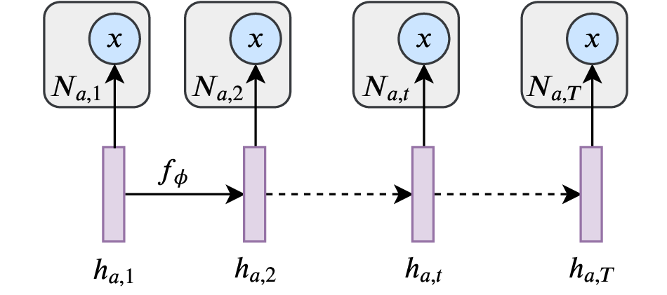
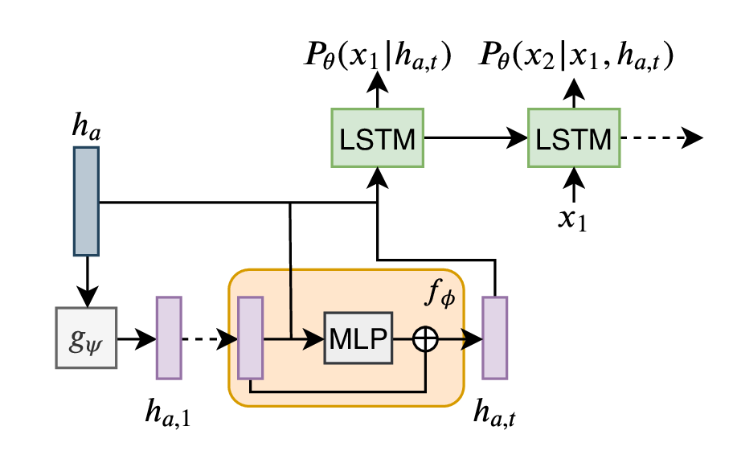

# Dynamic Author Representation
Official implementation of the paper [Learning Dynamic Author Representations with Temporal Language Models](https://url/pdf)

Edouard Delasalles, Sylvain Lamprier, Ludovic Denoyer


## Model

High level view | Detailed View
 :---: | :---: 
 | 

*x* are textual documents, and *h* are dynamic vector representation of authors. The representation vectors *h* evolve through time with a residual transition function *f*. The temporal author representation vectors are fed to an LSTM language model to predict next token probability.


## Requirements
- Python >= 3.6
- PyTorch 1.1.0
- `pytorch-pretrained-bert` 0.6.1

## Data
Data used in the paper are provided as `.tar.gz` archives in the `data` directory.
- `s2` corpus was processed from the `2018-05-03` version of the [Semantic Scholar corpus](https://api.semanticscholar.org/corpus/) [1]
- `nyt` corpus was processed from data provided by Yao et al. for their paper [Dynamic Word Embeddings for Evolving Semantic Discovery](https://sites.google.com/site/zijunyaorutgers/publications) [2]

## Reproducing results from the paper
To reproduce the experiments in the paper, you can run the commands below. You will need to add the option `--xp_dir model/will/be/saved/here` when launching an experiment to specify a location to save the model to. You can also run an experiment on a GPU by specifying `--device n` where `n` is a GPU device id.


### Semantic Scholar
#### Modeling:
```
python train.py --corpus s2 --task modeling --wd 0.0003
```

#### Imputation:
```
python train.py --corpus s2 --task imputation
```

#### Prediction:
```
python train.py --corpus s2 --task prediction --l2_a 1
```


### New York Time
#### Modeling:
```
python train.py --corpus nyt --task modeling --dropoutw 0.5 --dropouto 0.5 --lr_scheduling_burnin 25000 --lr_scheduling_niter 5000 --nlayers_dyn 2
```

#### Imputation:
```
python train.py --corpus nyt --task imputation --dropoutw 0.5 --dropouto 0.5 --lr_scheduling_burnin 25000 --lr_scheduling_niter 5000 --nlayers_dyn 2
```

#### Prediction:
```
python train.py --corpus nyt --task prediction --dropoutw 0.5 --dropouto 0.5 --lr_scheduling_burnin 25000 --lr_scheduling_niter 5000 --nlayers_dyn 2 --l2_a 1
```


## References
[1] Ammar, Waleed, et al. "Construction of the Literature Graph in Semantic Scholar." Proceedings of the 2018 Conference of the North American Chapter of the Association for Computational Linguistics: Human Language Technologies, Volume 3 (Industry Papers). 2018.

[2] Yao, Zijun, et al. "Dynamic word embeddings for evolving semantic discovery." Proceedings of the Eleventh ACM International Conference on Web Search and Data Mining. ACM, 2018.
